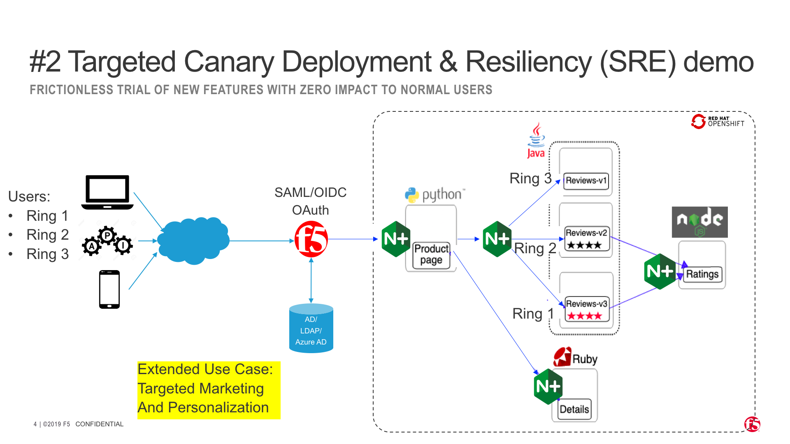
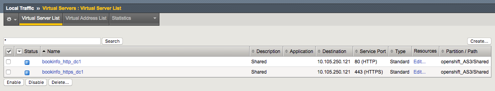
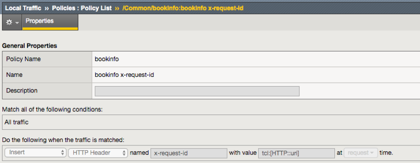
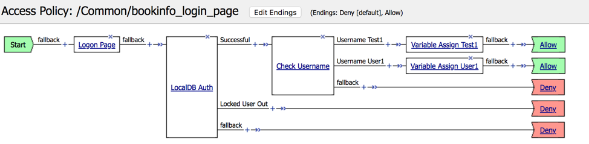
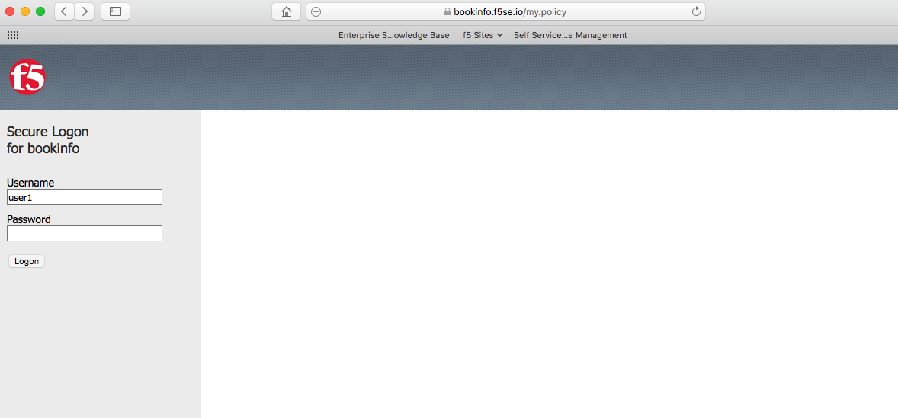
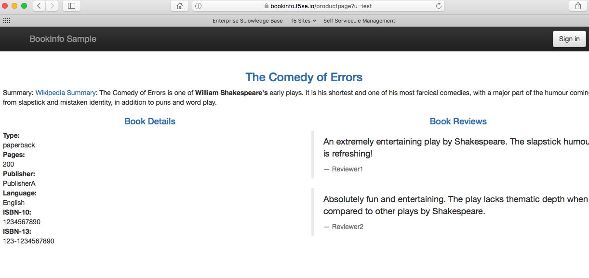
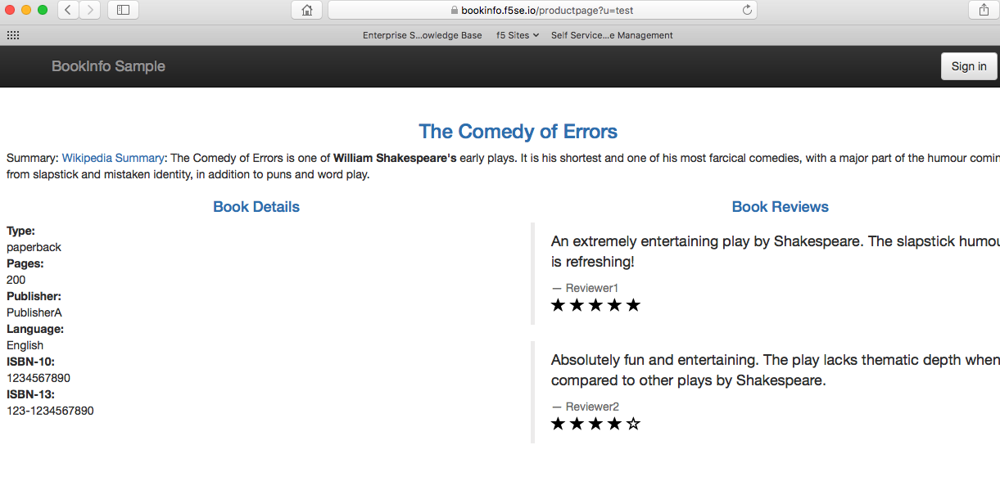
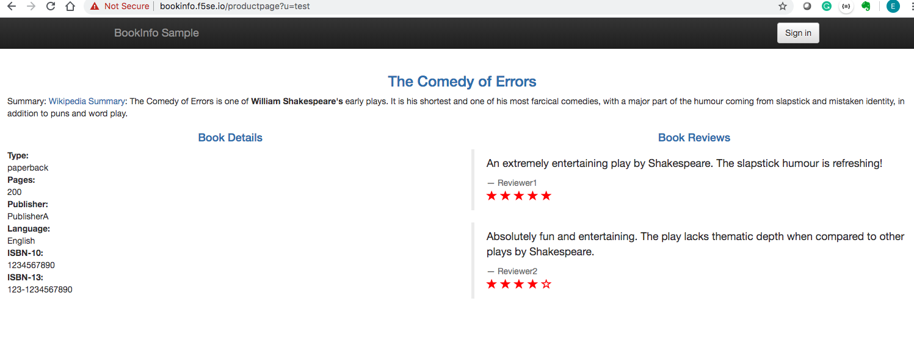

# Targeted Canary deployment with F5 and OpenShift

- [Getting Started](#getting-started)
  - [Summary](#summary)
  - [Use Case Scenario](#use-case-scenario)
  - [Understand Bookinfo Application](#understand-bookinfo-application)
  - [Configuration Steps](#configuration-steps)
    - [1. Prerequisites](#1-prerequisites)
    - [2. Install & Congfigure CIS](#2-install--congfigure-cis)
    - [3. Create secret](#3-create-secret)
    - [4. Deploy Bookinfo - Modified to include NGINX+](#4-deploy-bookinfo---modified-to-include-nginx)
    - [5. Use Configmap to configure NGINX](#5-use-configmap-to-configure-nginx)
    - [6. Create an OpenShift Route Resource](#6-create-an-openshift-route-resource)
    - [7. Configure BIG-IP Policy](#7-configure-big-ip-policy)
    - [8. BIG-IP APM Configuration](#8-big-ip-apm-configuration)
    - [9. Check Bookinfo application](#9-check-bookinfo-application)

## Summary
The Site Reliability Engineering or SRE demo will be centered around three distinct customer driven use cases. This lab will take you through setting up one of the 3 use cases: Targeted Canary Deployment.

## Use Case Scenario
This use case is to demonstrate the concept of Targeted Canary Deployment for Ring 1, Ring 2 and Ring 3 Users:
  1.	Ring 1 – Internal test users 
  2.	Ring 2 – Strategic partners (For MSFT Azure, these are their partner MVPs who blog about and promote upcoming be	ta features to create awareness)
  3.	Ring 3 – External Users 
 
 - Developer can promote and target new versions of the same microservice (version 1.2, 1.1, 1.0)  to targeted users (ring 1, 2 and 3) respectively, without involving and waiting the infrastructure operations team (NoOps).
- BIG-IP APM in N-S will authenticate and identify user as ring 1, 2 or 3. This identification is passed on to NGINX+ microgateway to direct users to the correct microservice version.
- This use case can be extended to Targeted Marketing and Personalization to cross-sell or up-sell targeted products.

**Note:** In this demo, we are demonstrating 2 users: Ring 1 - Internal test users (or test1), or Ring 3 - External users (or user1)



## Understand Bookinfo Application
The Bookinfo application used in this demo consists of these microservices:
- The productpage microservice calls the details and reviews microservices to populate the page.
- The details microservice contains book information.
- The reviews microservice contains book reviews. It also calls the ratings microservice.
- The ratings microservice contains book ranking information that accompanies a book review.

There are three versions of the reviews microservice:

- Version v1 does not call the ratings Service.
- Version v2 calls the ratings Service and displays each rating as one to five black stars.
- Version v3 calls the ratings Service and displays each rating as one to five red stars.


## Configuration Steps

### 1. Prerequisites
- Running OpenShift Cluster (3.11 used in this demo) 
- BIG-IP already installed
- DNS/FQDN in place (optional)

### 2. Install & Congfigure CIS 
You may follow the instruction [here](https://clouddocs.f5.com/containers/v2/openshift/kctlr-openshift-app-install.html#install-kctlr-openshift) to install the BIG-IP Controller for OpenShift.

The example below shows the basic config parameters we used for this demo to run the BIG-IP Controller in OpenShift:
```yaml
          args: [
            "--bigip-username=$(BIGIP_USERNAME)",
            "--bigip-password=$(BIGIP_PASSWORD)",
            "--bigip-url=10.105.250.100",
            "--bigip-partition=openshift",
            "--pool-member-type=cluster",
            "--openshift-sdn-name=/Common/ose-tunnel",
            "--manage-routes=true",
            "--namespace=bookinfo",
            "--route-vserver-addr=10.105.250.121",
            "--route-http-vserver=bookinfo-http-dc1",
            "--route-https-vserver=bookinfo-https-dc1",
            # AS3 override functionality
            "--override-as3-declaration=default/f5-override-as3-declaration",
            "--insecure=true",
            #"--log-as3-response=true",
            "--agent=as3"
```


### 3. Create secret
NGINX+ provides Zero Trust Networking (in this case for E-W traffic) with Mutual TLS (known as mTLS). To configure NGINX+ for Mutual TLS and access control, you can bring your own key and certificate, or use a free server SSL certificate.

With above, you can go ahead to create a secret for OpenShift Cluster (to store all SSL Key and Certificate), which will be referenced by productpage POD (or NGINX+ TLS).
```
oc create secret generic bookinfo-cert --from-file=ssl-key=./cert/httpbin.f5asean.local.key --from-file=ssl-cert=./cert/httpbin.f5asean.local.crt
```

### 4. Deploy Bookinfo - Modified to include NGINX+
Execute the following to deploy Bookinfo into your OpenShift:
```
oc create -f depoly-bookinfo-cj.yaml
```

Along with bookinfo application, NGINX+ will be deployed at each layer of the microservice as the respective microgateway for traffic steering.

Productpage services:
```yaml
##################################################################################################
# Productpage services
##################################################################################################
apiVersion: v1
kind: Service
metadata:
  name: productpage
  labels:
    app: productpage
    service: productpage
spec:
  ports:
  - port: 5000
    targetPort: 5000
    name: http
  - port: 8443
    targetPort: 8443
    name: https
  selector:
    app: productpage
---
apiVersion: apps/v1
kind: Deployment
metadata:
  name: productpage-v1
  labels:
    app: productpage
    version: v1
spec:
  replicas: 1
  selector:
    matchLabels:
      app: productpage
      version: v1
  template:
    metadata:
      labels:
        app: productpage
        version: v1
    spec:
      containers:
      - env:
        - name: TZ
          value: Asia/Singapore
        name: nginx
        image: cjunwchen/cj-centos-nginx-waf:latest
        volumeMounts:
        - name: config-volume
          mountPath: /etc/nginx/conf.d/productpage.conf
          subPath: productpage.conf
        - name: secret-volume
          mountPath: /app/cert
      - env:
        - name: TZ
          value: Asia/Singapore
        name: productpage
        image: docker.io/istio/examples-bookinfo-productpage-v1:1.15.0
        imagePullPolicy: IfNotPresent
        ports:
        - containerPort: 9080
      volumes:
      - name: config-volume
        configMap:
          name: bookinfo-productpage-conf
      - name: secret-volume
        secret:
          secretName: bookinfo-cert
          items:
            - key: ssl-cert
              path: ssl-cert
            - key: ssl-key
              path: ssl-key
```

Reviews service:
```yaml
##################################################################################################
# Reviews service
##################################################################################################
apiVersion: v1
kind: Service
metadata:
  name: reviews
  labels:
    app: reviews-nginx
    service: reviews
spec:
  ports:
  - port: 9080
    targetPort: 5000
    name: http
  selector:
    app: reviews-nginx
---
apiVersion: apps/v1
kind: Deployment
metadata:
  name: reviews-nginx
  labels:
    app: reviews-nginx
spec:
  replicas: 1
  selector:
    matchLabels:
      app: reviews-nginx
  template:
    metadata:
      labels:
        app: reviews-nginx
    spec:
      containers:
      - env:
        - name: TZ
          value: Asia/Singapore
        name: nginx
        image: cjunwchen/cj-centos-nginx-waf:latest
        volumeMounts:
        - name: config-volume
          mountPath: /etc/nginx/conf.d/review.conf
          subPath: review.conf
      volumes:
      - name: config-volume
        configMap:
          name: bookinfo-review-conf
```
### 5. Use Configmap to configure NGINX

Use a ConfigMap to config NGINX+ POD's which act as the microgateway's for east west (or E-W) traffic:
```
oc create -f config-bookinfo.yaml
```

Here is one ConfigMap example to config the NGINX+, to steer traffic to the different versions of review page, based on the user information extracted from HTTP *x_request_id*.

```yaml
##################################################################################################
# Configmap Review Services
##################################################################################################
apiVersion: v1
kind: ConfigMap
metadata:
  name: bookinfo-review-conf
data:
  review.conf: |-

    log_format elk_format_review 'time=[$time_local] client_ip=$remote_addr virtual=$server_name client_port=$remote_port xff_ip=$remote_addr lb_server=$upstream_addr http_host=$host http_method=$request_method http_request_uri=$request_uri status_code=$status content_type="$sent_http_content_type" content_length="$sent_http_content_length" response_time=$request_time referer="$http_referer" http_user_agent="$http_user_agent" x-request-id=$myid ';

    upstream reviewApp {
       server reviews-v1:9080;
    }

    upstream reviewApp_test {
       server reviews-v1:9080;
       server reviews-v2:9080;
       server reviews-v3:9080;
    }

    # map to different upstream backends based on header
    map $http_x_request_id $pool {
       ~*test.* "reviewApp_test";
       default "reviewApp";
    }

    server {
       listen 5000;
       server_name review;

       #error_log /var/log/nginx/internalApp.error.log info;
       access_log syslog:server=10.69.33.1:8516 elk_format_review;
       #access_log /var/tmp/nginx-access.log elk_format_review;

       set  $myid $http_x_request_id;
       if ($http_x_request_id ~* "(\w+)-(\w+)" ) {
         set  $myid  $2;
       }

       location / {
        proxy_pass http://$pool;
       }
    }
```

### 6. Create an OpenShift Route Resource

Add the BIG-IP Controller OpenShift Route Annotations to a Route Resource:

```yaml
apiVersion: v1
kind: Route
metadata:
    labels:
      name: f5-bookinfo-route-reencrypt-ssl
    name: f5-bookinfo-route-reencrypt-ssl
    namespace: bookinfo
    annotations:
      # annotations
      # default clientssl profile
      # default serverssl profile
      virtual-server.f5.com/clientssl: /Common/clientssl
      virtual-server.f5.com/serverssl: /Common/serverssl
      # health monitor
      virtual-server.f5.com/health: |
        [
          {
            "path": "bookinfo.f5se.io/",
            "send": "HTTP GET /",
            "monitor_type": "https",
            "interval": 5,
            "timeout": 16
          }
        ]
spec:
    host: bookinfo.f5se.io
    path: "/"
    port:
      targetPort: 8443
    tls:
      termination: reencrypt
    to:
      kind: Service
      name: productpage
```

Upload the Route to the OpenShift API server:
```
oc create -f bookinfo-route-reencrypt-ssl.yaml
```

All Route resources share two virtual servers:

- “	*bookinfo_http_dc1*” for HTTP traffic, and
- “	*bookinfo_https_dc1*” for HTTPS traffic.





###  7. Configure BIG-IP Policy
BIG-IP will pass on user identification to NGINX+ microgateway to direct users to the correct microservice version. It does so by injecting the header into *http_x_request_id*, carried to NGINX+.

Steps to configure BIG-IP:
- Create a policy with the rule shown below
- Attach the policy to HTTPS virtual server (manually, or using AS3 override)




###  8. BIG-IP APM Configuration 
BIG-IP APM in N-S will authenticate and identify user as ring 1 or 2.
To achieve above, you need to:
- Create APM policy as shown below
- Attach the policy to HTTPS virtual server (manually, or using AS3 override)




We recommend that you use AS3 override to attach APM policy (already created), so that CIS stays as the source of truth.  AS3 override functionality allows you to alter the existing BIG-IP configuration using AS3 with a user-defined config map without affecting the existing Kubernetes resources. For more information about AS3 override, you may refer [here](https://clouddocs.f5.com/containers/v2/kubernetes/kctlr-as3-override.html).

 In order to do so, you will need to add a new argument to the CIS deployment file. Run the following command to enable AS3 override functionality:
```
--override-as3-declaration=<namespace>/<user_defined_configmap_name>
```
Below is the user-defined config map to attach APM policy to the HTTPS virtual server (created by OpenShift route):
```yaml
apiVersion: v1
kind: ConfigMap
metadata:
  name: f5-override-as3-declaration
  namespace: default
data:
  template: |
    {
      "declaration": {
        "openshift_AS3": {
                "Shared": {
                    "bookinfo_https_dc1": {
                        "policyIAM":
                        {
                          "bigip": "/Common/bookinfo"
                        }
                    }
                }
            }
        }
    }
```

Create the config map by running the command:
```
oc create f5-override-as3-declaration.yaml
```
**Note**: You would have to restart CIS deployment after you deploy the configmap.

### 9. Check Bookinfo application

Now, we can login to test the application.
First, logon with the “user1” username:

The Ring 1 user (user1) will have access to Version v1 of Bookinfo Application only:


Next, logon with the "test1" username. By refreshing the page, you will have access to Version V1, V2 and V3 of the Bookinfo App:




