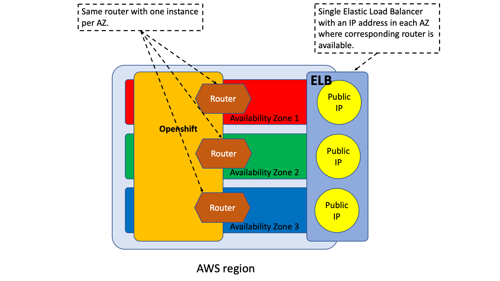

# Setting up GSLB Tool

## PREREQUISITES

- Openshift routers must be exposed with a public IP.
- Openshift API endpoints must be reachable from where this tool is run. It can be either a public or a private address but it must be reachable.
- Ansible with Kubernetes modules.
- The jq utility which is available in most Linux distributions or can be downloaded for any OS from the project’s page: https://stedolan.github.io/jq/download/ . The utility must be in the $PATH.
- The bash shell.

## Sample Topology in AWS

In this demo, we are running two OpenShift Clusters in AWS. For each cluster, we are referencing to a typical AWS OpenShift deployment with a two-tier LB arrangement shown below:



Note that each OpenShift cluster is deployed into 3 different Availability Zones (or AZ's). Each AZ is treated independently as it has its own dRouter name (aws1-az1, aws1-az2, and aws1-az3). 

## SETUP

1. Download the package, ie: *gslb-tool-\<release date\>.tar.gz*
2. Unpack it: 
   ```
   tar zxvf gslb-tool-<release date>.tar.gz
   ```
3. Change working directory to the gslb-tool’s created directory: 
   ```
   cd gslb-tools-<release date>
   ```
4. For convenience, add gslb-tool's working directory in the $PATH shell variable: 
   ```
   export PATH=$PATH:$PWD
   ```
5. Edit the file *vars/credentials.yaml* and fill the following variables.

```yaml
# Openshift user and password. One dictionary entry for each Openshift cluster.
k8s_user:
   aws1-az1: 
   aws1-az2: 
   aws1-az3:
   aws2-az1: 
   aws2-az2: 
   aws2-az3:

k8s_pass: 
   aws1-az1: 
   aws1-az2: 
   aws1-az3:
   aws2-az1: 
   aws2-az2: 
   aws2-az3:

# User and password for the F5 CloudServices account.
F5AAS_USER: 
F5AAS_PASS: 
```

6. Edit the file *vars/setup.yaml*. This file contains the deployment settings

The next variables apply to all deployments.

```yaml
# DNS name configuration settings.
#
# BASE_DOMAIN: is the part of the part of the DNS domain name that is not delegated 
#              to F5 CloudServices DNS LB.
# GSLB_ZONE:   is the name prefixed to BASE_DOMAIN that is delegated 
#              to F5 CloudServices DNS LB.
#
GSLB_ZONE: gslb
BASE_DOMAIN: thebizdevops.net
#
# The resulting GSLB domain is "{{GSLB_ZONE}}.{{BASE_DOMAIN}}" and 
# the GSLB records would be www.ocp.f5bddemos.io, crm.ocp.f5bddemos.io 
# following the sample values above.

# At present it is only supported either "https" or "http" routes 
# but not both types simulateneously. 
# Set this according to your requirements.
ROUTES_TYPE: "http"
```

The next variables are dictionaries that define the topology of the deployments. The following topologies are supported.

- Several Openshift/K8s deployments with a single router per deployment. This is the most typical scenario.
- Single Openshift/K8s deployment with several routers per deployment with or without route sharding.
- Any combination of the above. For example: deployment A may have one router, deployment B may have two routers with route sharding and deployment C could have 3 routers without route sharding.

A given Openshift/K8s deployment might have one or more routers, and we will assign a diferent name for each (dRouter for short).

Topology variables are indexed by these dRouter names. These topology variables are: 

- **apiEndpoint:** Contains the URL of the apiEndpoint of each dRouter. Deployments with several routers will have the same URL for different dRouters. 

- **publicAddress:** Contains the public IP address (host names should not be used) that is exposing each dRouter to the Internet. This will be load balanced by the F5 Cloud Services DNS LB. This IP is unique for each dRouter. An example using a typical scenario is shown next:

An example using a typical scenario is shown here:

```yaml
apiEndpoint:
   aws1-az1: "https://api.ocp42.thebizdevops.net:6443" 
   aws1-az2: "https://api.ocp42.thebizdevops.net:6443" 
   aws1-az3: "https://api.ocp42.thebizdevops.net:6443"
   aws2-az1: "https://api.cluster1.thebizdevops.net:6443"
   aws2-az2: "https://api.cluster1.thebizdevops.net:6443"
   aws2-az3: "https://api.cluster1.thebizdevops.net:6443"

publicAddress:
   onprem: "12.202.33.146"
   aws1-az1: "13.28.76.70"
   aws1-az2: "13.29.30.17"
   aws1-az3: "13.14.35.34"
   aws2-az1: "35.164.16.180"
   aws2-az2: "54.69.118.228"
   aws2-az3: "54.64.13.152"
```

### SETUP VERIFICATION

To finish the setup, run the *gslb-tool-verify* to verify that all components are in place and the configuration is sound.
```
gslb-tool-verify 
```
If all checks succeed you will see a similar message to the next one at the end of the command run. 

```
 myansible  ./gslb-tool-verify
>>>>>>>>>>>>>>>>>>>>>>>>>>>>>>>>>>>>>>>>>>>>>>>>>>>>>>>>>>>>>>>>>>>>>>>>>>>>>>>>>>>>>>>>>>>>>>>>>>>>>>>
>>> gslb-tool: Checking that all the requisite tools are in place...


>>> gslb-tool: All the required utilities and modules are ready.

>>>>>>>>>>>>>>>>>>>>>>>>>>>>>>>>>>>>>>>>>>>>>>>>>>>>>>>>>>>>>>>>>>>>>>>>>>>>>>>>>>>>>>>>>>>>>>>>>>>>>>>
>>> gslb-tool: Checking reachability and login credentials to F5 Cloud Services...
...
...
...

>>>>>>>>>>>>>>>>>>>>>>>>>>>>>>>>>>>>>>>>>>>>>>>>>>>>>>>>>>>>>>>>>>>>>>>>>>>>>>>>>>>>>>>>>>>>>>>>>>>>>>>
>>>>>>>>>>>>>>>>>>>>>>>>>>>>>>>>>>>>>>>>>>>>>>>>>>>>>>>>>>>>>>>>>>>>>>>>>>>>>>>>>>>>>>>>>>>>>>>>>>>>>>>
>>> gslb-tool: All checks have succeeded. The tool is ready to be used.
>>>>>>>>>>>>>>>>>>>>>>>>>>>>>>>>>>>>>>>>>>>>>>>>>>>>>>>>>>>>>>>>>>>>>>>>>>>>>>>>>>>>>>>>>>>>>>>>>>>>>>>
>>>>>>>>>>>>>>>>>>>>>>>>>>>>>>>>>>>>>>>>>>>>>>>>>>>>>>>>>>>>>>>>>>>>>>>>>>>>>>>>>>>>>>>>>>>>>>>>>>>>>>>

```
The tool is ready to be used.
