# Getting Started

## Summary
In an organization with enough maturity in terms of cybersecurity and modern app architecture, enterprises run two different cybersecurity teams to operate the more advanced security policies for the company. NetSecOps and DevSecOps are two other cybersecurity teams in an organization, and they have different security requirements. NetSecOps typically wants to have a ‘Standardized Application Security,’ and they want to block commonly used attack types with high-confidence, meaning that ‘low-false positive rate,’ at the network level. And OWASP Top 10 threats could be a good example here. But for DevSecOps, they want to have the application-specific security policies for different types of applications in OpenShift. Since DevSecOps understands how their applications work, they want to apply different security policies for their backend applications.

## Use Case Scenario
This use case demonstrates how organizations position F5 AWAF and NAP(NGINX App Protect) to provide the advanced application security policies for NetSecOps and DevSecOps in OpenShift environment. In this demo, we suppose that NetSecOps wants to block OWASP Top 10 threats while DevSecOps intends to have a different 'file accessing' policy for each backend application. Below is the table for each team's requirements.  


## Configuration Steps

### Prerequisites
- Running OpenShift Cluster (3.11 used in this demo) 
- ELK installed
- Evaluation license of NAP(NGINX App Protect)
- You can request the evaluation license of the NGINX App Protect in [here](https://www.nginx.com/free-trial-request/).
- BIG-IP AWAF already installed
- CIS Installed (You may follow the instruction [here](https://clouddocs.f5.com/containers/v2/openshift/kctlr-openshift-app-install.html#install-kctlr-openshift) to install the BIG-IP Controller for OpenShift.)

The example below shows the basic config parameters we used for this demo to run the BIG-IP Controller in OpenShift:
```
args: [
            "--bigip-username=$(BIGIP_USERNAME)",
            "--bigip-password=$(BIGIP_PASSWORD)",
            "--bigip-url=https://20.0.1.72:8443",
            "--insecure=true",
            "--bigip-partition=ocp",
            "--namespace=devsecops",
            "--manage-routes=true",
            "--route-vserver-addr=20.0.1.72",
            "--route-http-vserver=devsecops_http_vs",
            "--route-https-vserver=devsecops_https_vs",
            "--override-as3-declaration=default/f5-override-as3-declaration",
            "--agent=as3",
            "--pool-member-type=cluster",
            "--openshift-sdn-name=/Common/ocp-tunnel"
          ]
```


### Demo diagram
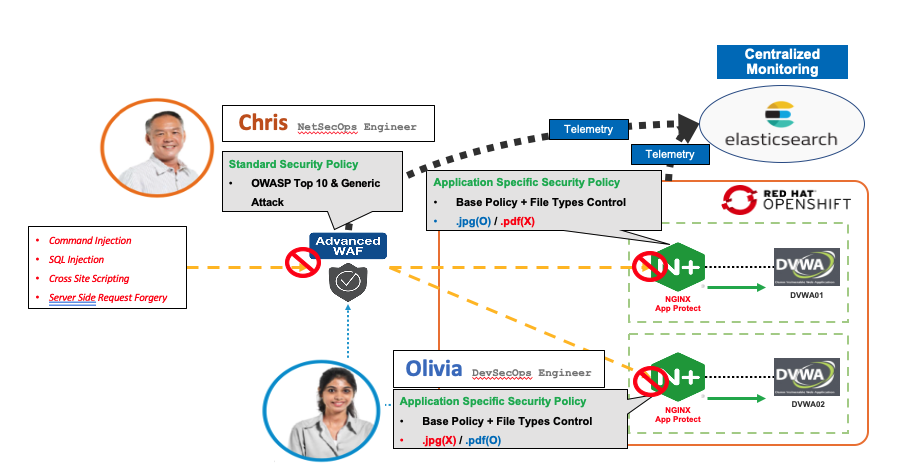

### Install NAP(NGINX App Protect) and DVWA Applications
- You have to complete this step first -> [here].(https://github.com/network1211/f5-security-automation-ansible/blob/master/devsecops/malicious_pod/nap_create/README.md)

*Install DVWA applications with NAP protection* 
The below file will install two DVWA applications with NAP as a proxy mode. You have to replace 'your_nap_image_path' by your NAP container image path. 

```
dvwa-nap-deployment.yaml 

##################################################################################################
# DVWA App01
##################################################################################################
apiVersion: v1
kind: Service
metadata:
  name: dvwa01
  labels:
    app: dvwa01
    service: dvwa01
spec:
  ports:
  - port: 8080
    targetPort: 8080
    name: http
  selector:
    app: dvwa01
---
apiVersion: apps/v1
kind: Deployment
metadata:
  name: dvwa01-v1
  labels:
    app: dvwa01
    version: v1
spec:
  replicas: 1
  selector:
    matchLabels:
      app: dvwa01
      version: v1
  template:
    metadata:
      labels:
        app: dvwa01
        version: v1
    spec:
      containers:
      - env:
        - name: TZ
          value: UTC
        name: nginx01
        image: your_nap_image_path
        volumeMounts:
        - name: config-volume
          mountPath: /etc/nginx/conf.d/nginx_sre.conf
          subPath: nginx_sre.conf
        - name: config-volume
          mountPath: /etc/nginx/NginxSRELabPolicy.json
          subPath: NginxSRELabPolicy.json
      - env:
        - name: TZ
          value: UTC
        name: dvwa01
        image: network1211/dvwa01:2.0
        imagePullPolicy: IfNotPresent
        ports:
        - containerPort: 80
      volumes:
      - name: config-volume
        configMap:
          name: dvwa01-conf
---
##################################################################################################
# DVWA App02
##################################################################################################
apiVersion: v1
kind: Service
metadata:
  name: dvwa02
  labels:
    app: dvwa02
    service: dvwa02
spec:
  ports:
  - port: 8080
    targetPort: 8080
    name: http
  selector:
    app: dvwa02
---
apiVersion: apps/v1
kind: Deployment
metadata:
  name: dvwa02-v1
  labels:
    app: dvwa02
    version: v1
spec:
  replicas: 1
  selector:
    matchLabels:
      app: dvwa02
      version: v1
  template:
    metadata:
      labels:
        app: dvwa02
        version: v1
    spec:
      containers:
      - env:
        - name: TZ
          value: UTC
        name: nginx02
        image: your_nap_image_path
        volumeMounts:
        - name: config-volume
          mountPath: /etc/nginx/conf.d/nginx_sre.conf
          subPath: nginx_sre.conf
        - name: config-volume
          mountPath: /etc/nginx/NginxSRELabPolicy.json
          subPath: NginxSRELabPolicy.json
      - env:
        - name: TZ
          value: UTC
        name: dvwa02
        image: network1211/dvwa02:2.0
        imagePullPolicy: IfNotPresent
        ports:
        - containerPort: 80
      volumes:
      - name: config-volume
        configMap:
          name: dvwa02-conf
```

```
oc create -f dvwa-nap-deployment.yaml
```

*Configuring NAP policies with Configmap*
The below file includes two different NAP policies for different 'file accessing' policies and custom blocking page. You have to replace 'your_elk_ip_here' with your real ELK server IP address.

```
dvwa-nap-config.yaml

##################################################################################################
# Configmap DVWA01
##################################################################################################
apiVersion: v1
kind: ConfigMap
metadata:
  name: dvwa01-conf
data:
  nginx_sre.conf: | 
   
   upstream dvwa01 {
       server 127.0.0.1:80;            
   }
 
    server {
       listen 8080;
       server_name dvwa01-http;
       proxy_http_version 1.1;
       
       real_ip_header X-Forwarded-For;     
       set_real_ip_from 0.0.0.0/0;
    
       app_protect_enable on;
       app_protect_security_log_enable on;
       app_protect_policy_file "/etc/nginx/NginxSRELabPolicy.json";
       app_protect_security_log "/etc/app_protect/conf/log_default.json" syslog:server=your_elk_ip_here;

       location / {
           client_max_body_size 0;
           default_type text/html;
           proxy_pass http://dvwa01;
           proxy_set_header Host $host;
       }
   }
  NginxSRELabPolicy.json: |
    {
      "policy": {
        "name": "SRE_DVWA01_POLICY",
        "template": { "name": "POLICY_TEMPLATE_NGINX_BASE" },
        "applicationLanguage": "utf-8",
        "enforcementMode": "blocking",
        "response-pages": [
            {
                "responseContent": "<html><head><title>SRE DevSecOps - DVWA01 - Blocking Page</title></head><body><font color=green size=10>NGINX App Protect Blocking Page - DVWA01 Server</font><br><br>Please consult with your administrator.<br><br>Your support ID is: <%TS.request.ID()%><br><br><a href='javascript:history.back();'>[Go Back]</a></body></html>",
                "responseHeader": "HTTP/1.1 302 OK\\r\\nCache-Control: no-cache\\r\\nPragma: no-cache\\r\\nConnection: close",
                "responseActionType": "custom",
                "responsePageType": "default"
            }
        ],
        "blocking-settings": {
            "violations": [
                {
                    "name": "VIOL_FILETYPE",
                    "alarm": true,
                    "block": true
                }
            ]
        },
        "filetypes": [
            {
                "name": "*",
                "type": "wildcard",
                "allowed": true,
                "checkPostDataLength": false,
                "postDataLength": 4096,
                "checkRequestLength": false,
                "requestLength": 8192,
                "checkUrlLength": true,
                "urlLength": 2048,
                "checkQueryStringLength": true,
                "queryStringLength": 2048,
                "responseCheck": false
            },
            {
                "name": "pdf",
                "allowed": false
            }
        ]
    }
    }
---
##################################################################################################
# Configmap DVWA02
##################################################################################################
apiVersion: v1
kind: ConfigMap
metadata:
  name: dvwa02-conf
data:
  nginx_sre.conf: | 
   
   upstream dvwa02 {
       server 127.0.0.1:80;            
   }
 
    server {
       listen 8080;
       server_name dvwa02-http;
       proxy_http_version 1.1;
       
       real_ip_header X-Forwarded-For;     
       set_real_ip_from 0.0.0.0/0;
    
       app_protect_enable on;
       app_protect_security_log_enable on;
       app_protect_policy_file "/etc/nginx/NginxSRELabPolicy.json";
       app_protect_security_log "/etc/app_protect/conf/log_default.json" syslog:server=your_elk_ip_here;

       location / {
           client_max_body_size 0;
           default_type text/html;
           proxy_pass http://dvwa02;
           proxy_set_header Host $host;
       }
   }
  NginxSRELabPolicy.json: |
    {
      "policy": {
        "name": "SRE_DVWA02_POLICY",
        "template": { "name": "POLICY_TEMPLATE_NGINX_BASE" },
        "applicationLanguage": "utf-8",
        "enforcementMode": "blocking",
        "response-pages": [
            {
                "responseContent": "<html><head><title>SRE DevSecOps - DVWA02 - Blocking Page</title></head><body><font color=green size=10>NGINX App Protect Blocking Page - DVWA02 Server</font><br><br>Please consult with your administrator.<br><br>Your support ID is: <%TS.request.ID()%><br><br><a href='javascript:history.back();'>[Go Back]</a></body></html>",
                "responseHeader": "HTTP/1.1 302 OK\\r\\nCache-Control: no-cache\\r\\nPragma: no-cache\\r\\nConnection: close",
                "responseActionType": "custom",
                "responsePageType": "default"
            }
        ],
        "blocking-settings": {
            "violations": [
                {
                    "name": "VIOL_FILETYPE",
                    "alarm": true,
                    "block": true
                }
            ]
        },
        "filetypes": [
            {
                "name": "*",
                "type": "wildcard",
                "allowed": true,
                "checkPostDataLength": false,
                "postDataLength": 4096,
                "checkRequestLength": false,
                "requestLength": 8192,
                "checkUrlLength": true,
                "urlLength": 2048,
                "checkQueryStringLength": true,
                "queryStringLength": 2048,
                "responseCheck": false
            },
            {
                "name": "jpg",
                "allowed": false
            }
        ]
    }
    }
---
```

```
oc create -f dvwa-nap-config.yaml
```


*Configuring Routemap* 
You have to replace 'your_app_domain_here' with your real application domain.

```
dvwa-route-nap.yaml

##################################################################################################
# DVWA01 Route
##################################################################################################
apiVersion: v1
kind: Route
metadata:
    labels:
      name: f5-dvwa01-route
    name: f5-dvwa01-route
    namespace: devsecops
    annotations:
      # health monitor
      virtual-server.f5.com/health: |
        [
          {
            "path": "your_app_domain_here/",
            "send": "",
            "protocol": "tcp",
            "interval": 10,
            "timeout": 20
          }
        ]
spec:
    host: dvwa01.devsecops.com
    path: "/"
    port:
      targetPort: 8080
    to:
      kind: Service
      name: dvwa01
---
##################################################################################################
# DVWA02 Route
##################################################################################################
apiVersion: v1
kind: Route
metadata:
    labels:
      name: f5-dvwa02-route
    name: f5-dvwa02-route
    namespace: devsecops
    annotations:
      # health monitor
      virtual-server.f5.com/health: |
        [
          {
            "path": "your_app_domain_here/",
            "send": "",
            "protocol": "tcp",
            "interval": 10,
            "timeout": 20
          }
        ]
spec:
    host: dvwa02.devsecops.com
    path: "/"
    port:
      targetPort: 8080
    to:
      kind: Service
      name: dvwa02
```

```
oc create -f dvwa-route-nap.yaml
```


### Configuring AWAF 

F5 AWAF(Advanced WAF) is the leading WAF solution in the application security market, and it has many different advanced features to protect the applications against a sophisticated Layer-7 level attack. The security policy of the AWAF has to protect backend applications correctly, but at the same time, it must ensure the legitimate user traffic access to the backend resources without issue. It sounds simple, but it is not easy to configure the right security policies to achieve both goals simultaneously. In this use-case, we configure the AWAF policy for demo purposes only. You should not follow the configuration process in this demo to create your AWAF policy in your production network. You can find the best practice for AWAF policy creation from [here.](https://support.f5.com/csp/article/K74535942) 

1. Login to AWAF GUI, Go to 'Security' -> 'Application Security' -> 'Security Policies' -> 'Create'
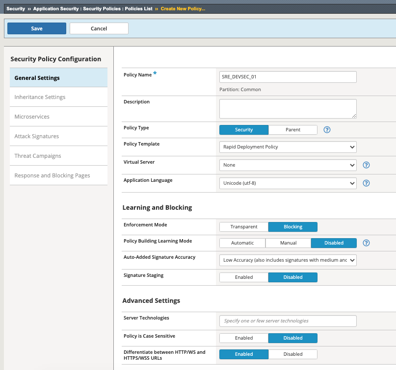

2. Click the security policy you just created (SRE_DEVSEC_01)
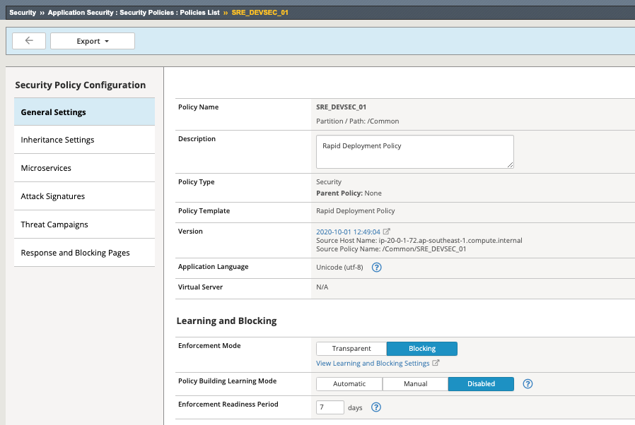

- Click the 'View Learning and Blocking Settings' under the 'Enforcement Mode' menu

3. Expand 'Attack Signatures' and Click 'Change' menu
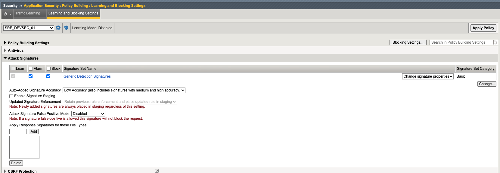

- Apply the check box like the below.
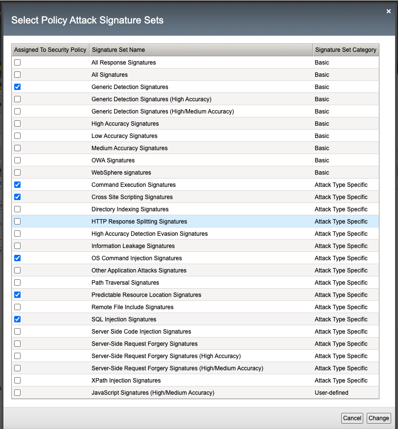

- 'Close', 'Save' and 'Apply Policy' 

4. Apply the policy to the virtual server
Please make sure that you're on OCP partition.
- 'Local Traffic' -> 'Virtual Servers' -> 'devsecops_http_vs' -> Security -> Policies
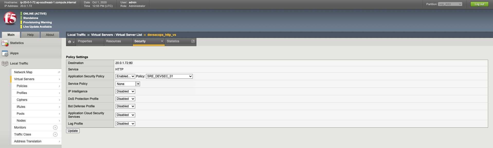

5. Configuring custom blocking page for AWAF
- Click the security policy you created (SRE_DEVSEC_01)
- 'Response and Blocking page' -> 'Blocking page default' -> 'Custom response' -> 'Response Body'
```
<html><head><title>Request Rejected</title></head><body>The requested URL was rejected. Please consult with your administrator.<br><br>Your support ID is: <%TS.request.ID()%><br><br><a href='javascript:history.back();'>[Go Back]</a></body></html>
```

### Configuring ELK integration 
*AWAF Logging Profile config*
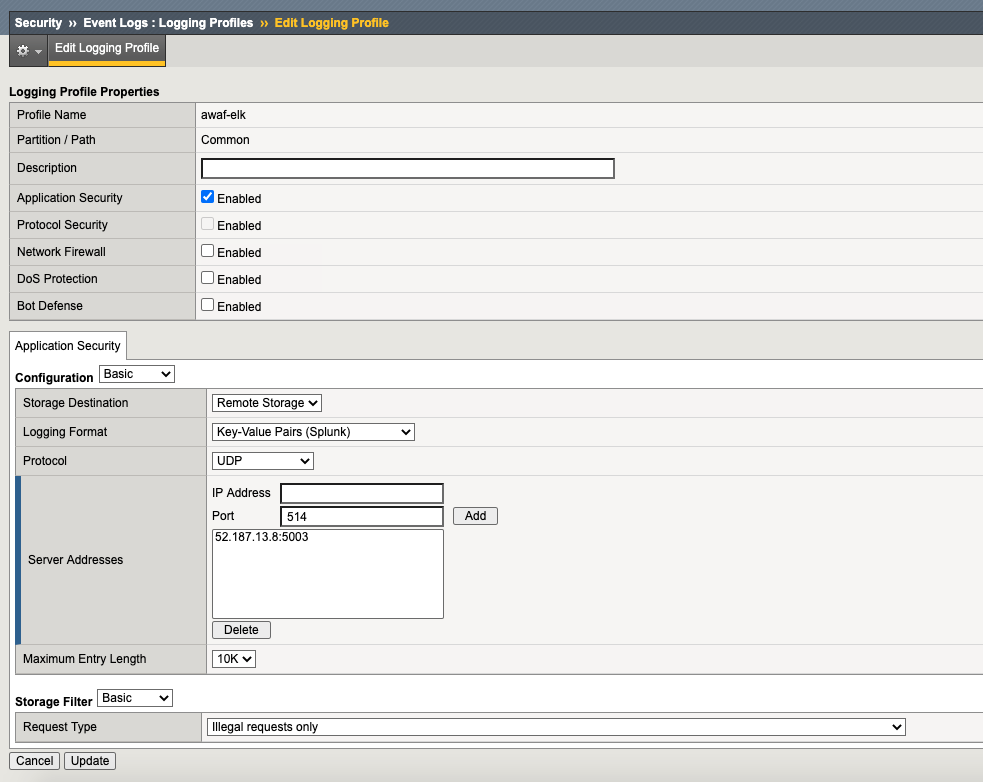

*Logstash Config Example*

```
logstash.conf

input {
    syslog {
        port => 5003
        type => f5elk
        }
}

filter {
if [type] == "f5elk" {
        
        grok {
            match => {
                "message" => [
                ",attack_type=\"%{DATA:attack_type}\"",
                ",blocking_exception_reason=\"%{DATA:blocking_exception_reason}\"",
                ",date_time=\"%{DATA:date_time}\"",
                ",dest_port=\"%{DATA:dest_port}\"",
                ",ip_client=\"%{DATA:ip_client}\"",
                ",is_truncated=\"%{DATA:is_truncated}\"",
                ",method=\"%{DATA:method}\"",
                ",policy_name=\"%{DATA:policy_name}\"",
                ",protocol=\"%{DATA:protocol}\"",
                ",request_status=\"%{DATA:request_status}\"",
                ",response_code=\"%{DATA:response_code}\"",
                ",severity=\"%{DATA:severity}\"",
                ",sig_cves=\"%{DATA:sig_cves}\"",
                ",sig_ids=\"%{DATA:sig_ids}\"",
                ",sig_names=\"%{DATA:sig_names}\"",
                ",sig_set_names=\"%{DATA:sig_set_names}\"",
                ",src_port=\"%{DATA:src_port}\"",
                ",sub_violations=\"%{DATA:sub_violations}\"",
                ",support_id=\"%{DATA:support_id}\"",
                ",unit_hostname=\"%{DATA:unit_hostname}\"",
                ",uri=\"%{DATA:uri}\"",
                ",violation_rating=\"%{DATA:violation_rating}\"",
                ",vs_name=\"%{DATA:vs_name}\"",
                ",x_forwarded_for_header_value=\"%{DATA:x_forwarded_for_header_value}\"",
                ",outcome=\"%{DATA:outcome}\"",
                ",outcome_reason=\"%{DATA:outcome_reason}\"",
                ",violations=\"%{DATA:violations}\"",
                ",violation_details=\"%{DATA:violation_details}\"",
                ",request=\"%{DATA:request}\""
                ]
        }
    break_on_match => false
  }
  
        mutate {
        split => { "attack_type" => "," }
        split => { "sig_ids" => "," }
        split => { "sig_names" => "," }
        split => { "sig_cves" => "," }
        split => { "staged_sig_ids" => "," }
        split => { "staged_sig_names" => "," }
        split => { "staged_sig_cves" => "," }
        split => { "sig_set_names" => "," }
        split => { "threat_campaign_names" => "," }
        split => { "staged_threat_campaign_names" => "," }
        split => { "violations" => "," }
        split => { "sub_violations" => "," }
  
        remove_field => [ "date_time", "message" ]
        }

        if [x_forwarded_for_header_value] != "N/A" {
                mutate { add_field => { "source_host" => "%{x_forwarded_for_header_value}"}}
                } else {
                        mutate { add_field => { "source_host" => "%{ip_client}"}}
                }
  
   geoip {
    source => "source_host"
    database => "/etc/logstash/GeoLite2-City.mmdb"
}
}
}

output {
if [type] == 'f5elk' {
         elasticsearch {
                hosts => ["127.0.0.1:9200"]
                index => "f5elk-%{+YYYY.MM.dd}"
        }
}
}
```

*Example ELK Output*
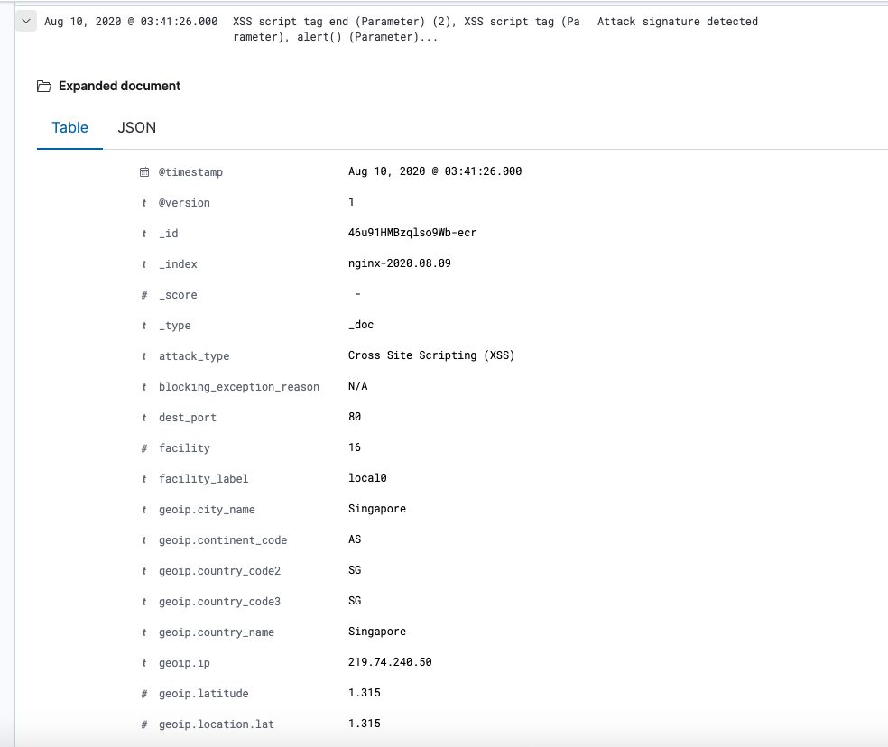

*Apply Logging profile to VS*
- 'Local Traffic' -> 'Virtual Servers' -> 'devsecops_http_vs' -> Security -> Policies
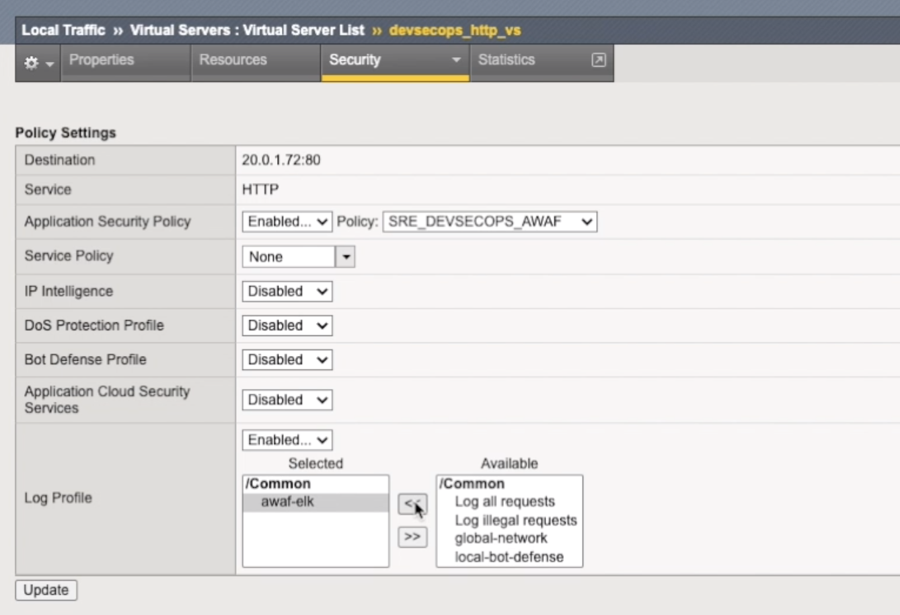

### Simulating the Attack
Login to Application 01 and 02. (ID:admin / PW:password)

1. Command Injection Attack
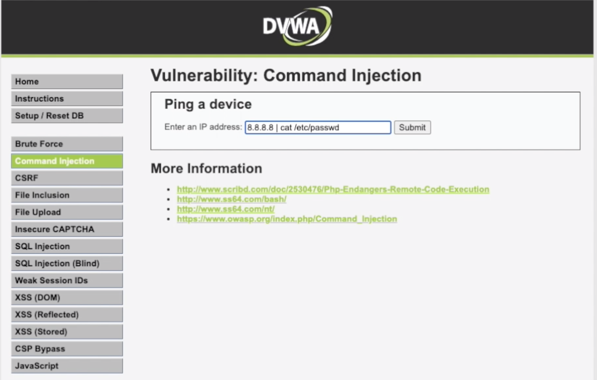

```
8.8.8.8; cat /etc/passwd
```

You should be able to see the blocking page of AWAF. 
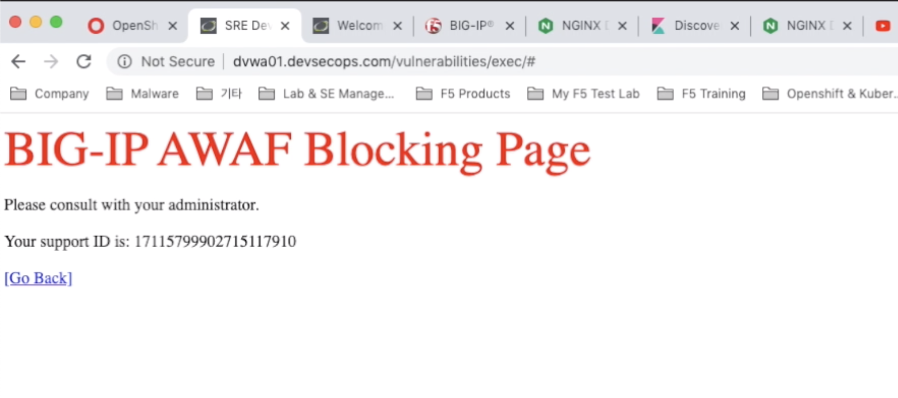

2. SQL Injection


```
%' and 1=0 union select null, concat(user,':',password) from users #
```

You should be able to see the blocking page of AWAF. 


3. Cross Site Scripting (XSS)


```
<script>alert(document.cookie)</script>
```

You should be able to see the blocking page of AWAF. 


4. File Access
1) Access to App01 on the browser with URL -> "http://your_app_domain.com/hackable/uploads/"
   - You should be able to see two files - 'F5_Networks.jpg' and 'NGINX.pdf'
   - Click both files. 
   - You should be able to see the blocking page of NGINX when you click the 'pdf' file.

   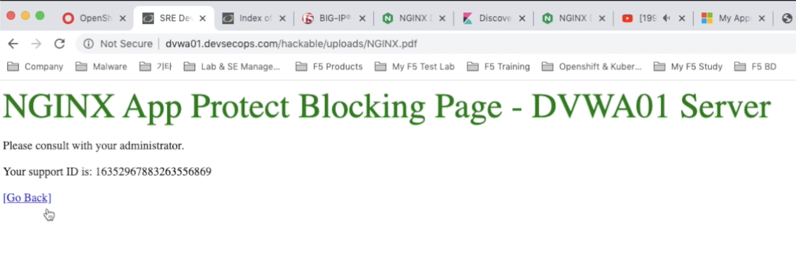

2) Access to App02 on the browser with URL -> "http://your_app_domain.com/hackable/uploads/"
   - You should be able to see two files - 'F5_Networks.jpg' and 'NGINX.pdf'
   - Click both files. 
   - You should be able to see the blocking page of NGINX when you click the 'jpg' file.

   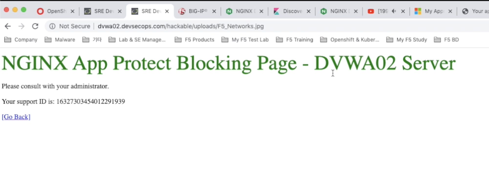

