# Getting Started

## Summary
Canary deployment is an S/W releasing technique to reduce the risk of introducing new features or a new version in production for the DevOps team. In our SRE demo series, we already introduced how our customers easily can release their new S/W version with minimum risk using the canary deployment model. You can find more details of 'SRE Canary Deployment' use-case in [here](sre-usecases/01-targeted-canary/README.md).
In this use-case, we've enhanced our existing canary deployment use-case with F5 APM(Access Policy Manager), NGINX+, Microsoft Azure AD, and Red Hat OpenShift. You can learn how F5 components help to apply canary deployment in your containerized environment in this demo.

## Prerequisites
- BIG-IP APM and NGINX+ already installed
- Running OpenShift Cluster (3.11 used in this demo) 
- Must complete to install F5 CIS, bookinfo application and NGINX+ (You can find the installation steps in [here](sre-usecases/01-targeted-canary/README.md).

## Use Case Scenario
This use case is to demonstrate the concept of Targeted Canary Deployment for two user groups - 'F5 employee' and 'Non-F5 employee':

1. Developer can promote and target new versions of the same microservice (v1,v2,v3) to targeted users (Group1-F5 employee / Group2-nonF5 employee) respectively, without involving and waiting for the infrastructure operations team (NoOps).
2. BIG-IP APM in N-S will authenticate users through the interaction with an external MS Azure AD B2C service using OAuth. 
3. Once the user is authenticated successfully by MS Azure AD, Azure AD sends the user-specific information through JWT(JSON Web Token). 
4. After APM receives the token from the Azure AD, then it creates a new JWT and passes it to the backend NGINX+.
5. Once the NGINX+ receives the token, it extracts the user data and direct users to the correct microservice version based on the policy.

## Configuration Steps

## 1. Configuring Microsoft Azure AD B2C

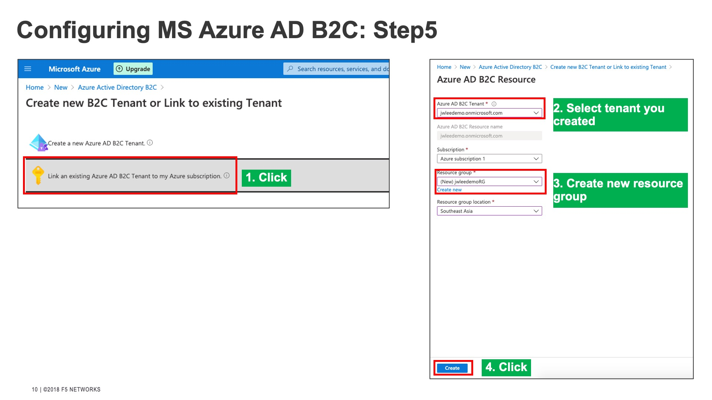

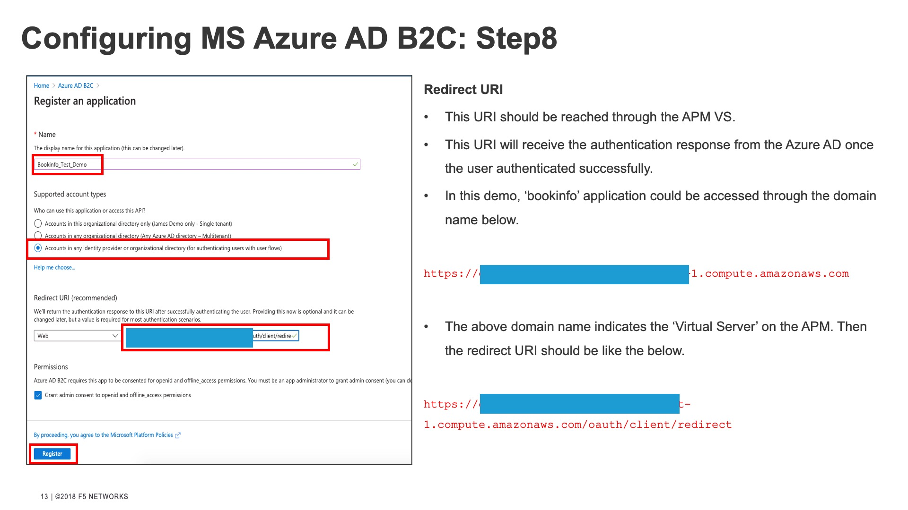
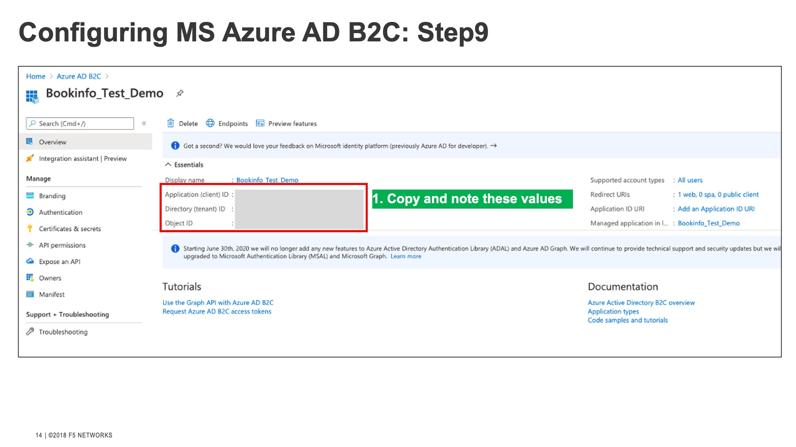

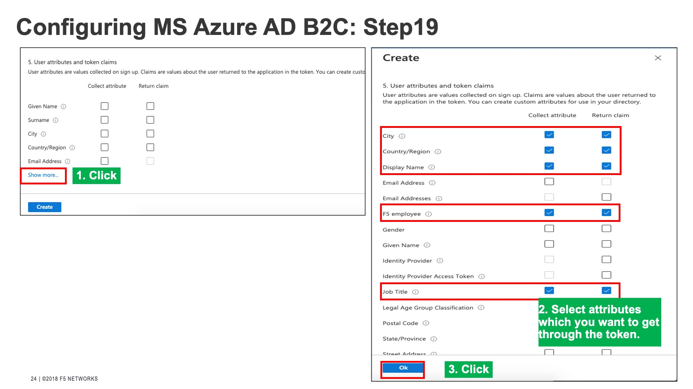
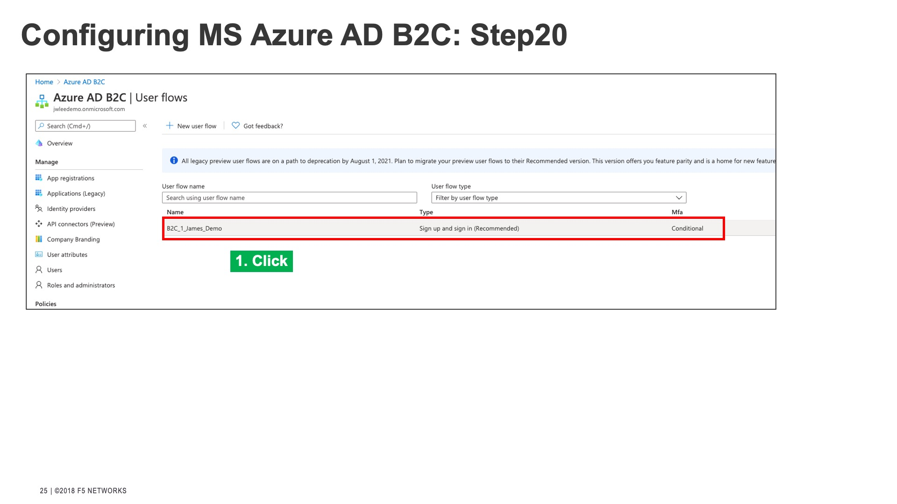
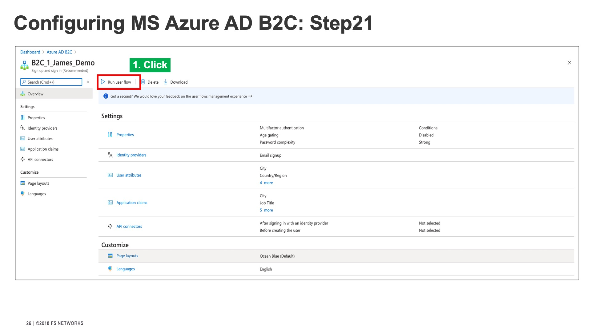
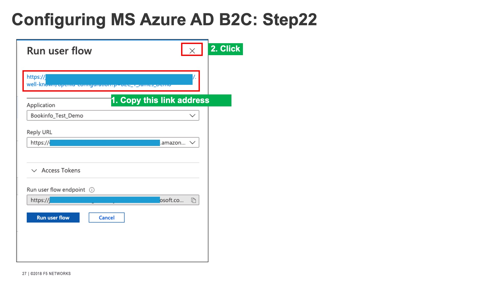

## 2. Configuring F5 APM(Access Policy Manager)
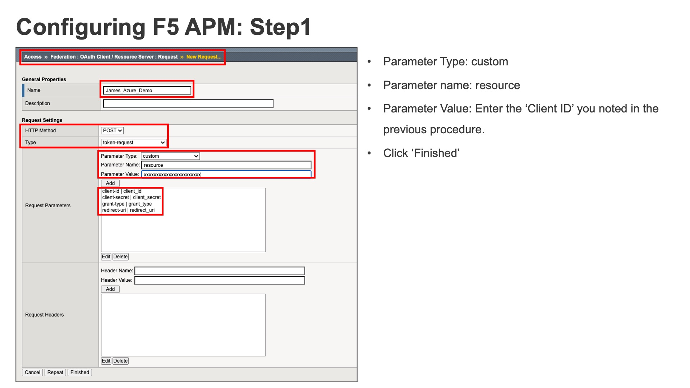

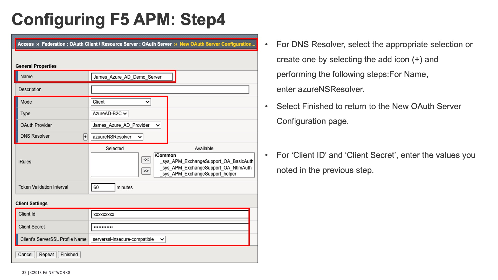
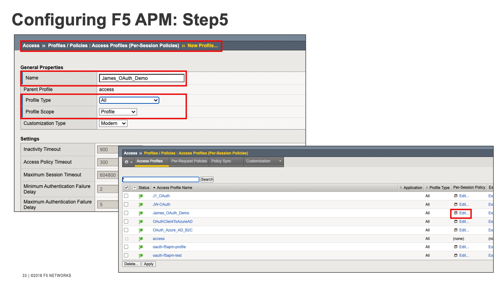
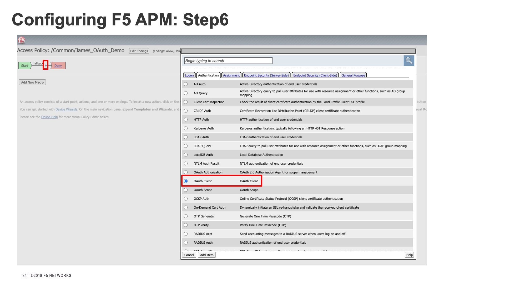

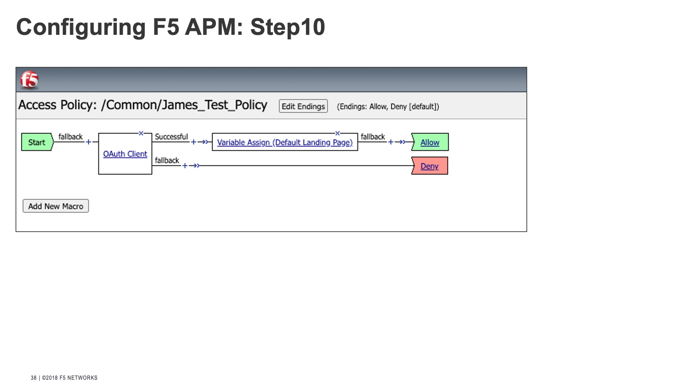

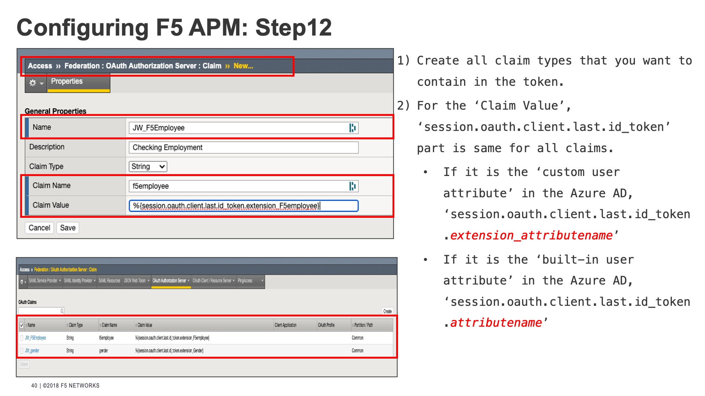
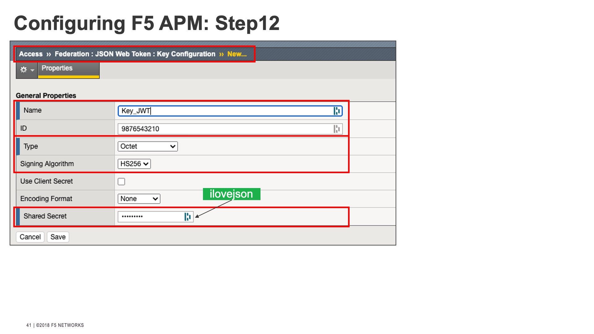

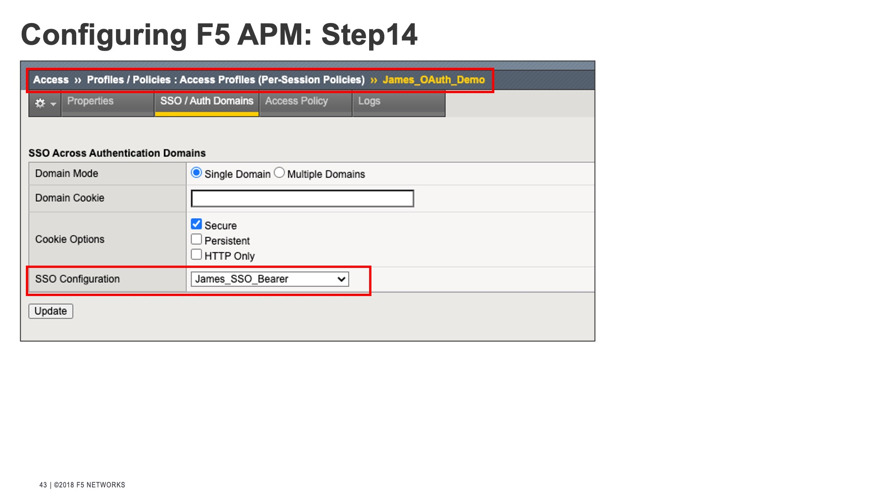

## 3. Configuring NGINX Plus

## 4. Verifying Result

